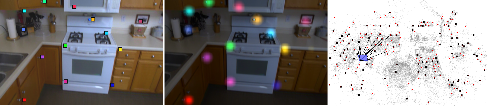
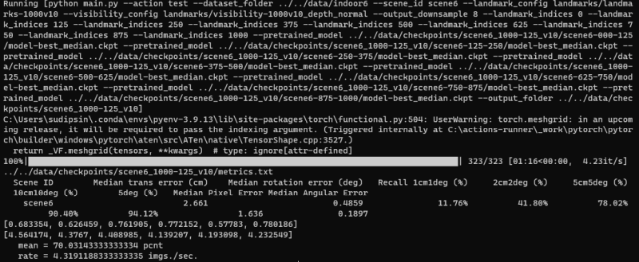

# Scene Landmark Detection for Camera Localization

## Introduction


We have devised a new method to detect scene-specific _scene landmarks_ for localizing a camera within a pre-mapped scene. Our method is privacy-preserving, has low storage requirements and achieves high accuracy. **[Left]** Scene landmarks detected in a query image. **[Middle]** A CNN-based heatmap prediction architecture is trained. **[Right]** The 3D scene 
landmarks (_in red_) and the estimated camera pose (_in blue_) are shown overlaid over the 3D point cloud (_in gray_). The 3D point 
cloud is shown only for visualization. It is not actually used for camera localization.

---  

## Papers
**Improved Scene Landmark Detection for Camera Localization**  
Tien Do and Sudipta N. Sinha  
International Conference on 3D Vision (**3DV**), 2024  
[pdf](paper/DoSinha3DV2024.pdf)  

**Learning to Detect Scene Landmarks for Camera Localization**  
Tien Do, Ondrej Miksik, Joseph DeGol, Hyun Soo Park, and Sudipta N. Sinha  
IEEE/CVF Conference on Computer Vision and Pattern Recognition (**CVPR**), 2022  
[pdf](paper/DoEtalCVPR2022.pdf) &nbsp; [video](https://www.youtube.com/watch?v=HM2yLCLz5nY) 

**Indoor6 Dataset**  
[download](https://drive.google.com/drive/folders/1w7Adnd6MXmNOacT072JnQ6emHUeLrD71?usp=drive_link)

## Bibtex
If you find our work to be useful in your research, please consider citing our paper:
```
@InProceedings{Do_Sinha_2024_ImprovedSceneLandmarkLoc,
    author     = {Do, Tien and Sinha, Sudipta N.},
    title      = {Improved Scene Landmark Detection for Camera Localization},
    booktitle  = {Proceedings of the International Conference on 3D Vision (3DV)},
    month      = {March},
    year       = {2024}
}

@InProceedings{Do_2022_SceneLandmarkLoc,
    author     = {Do, Tien and Miksik, Ondrej and DeGol, Joseph and Park, Hyun Soo and Sinha, Sudipta N.},
    title      = {Learning to Detect Scene Landmarks for Camera Localization},
    booktitle  = {Proceedings of the IEEE/CVF Conference on Computer Vision and Pattern Recognition (CVPR)},
    month      = {June},
    year       = {2022}
}
```

# Indoor-6 Dataset

The Indoor-6 dataset was created from multiple sessions captured in six indoor scenes over multiple days. The pseudo 
ground truth (pGT) 3D point clouds and camera poses for each scene are computed using [COLMAP](https://colmap.github.io/). All training data uses only colmap reconstruction from training images. The figure below 
shows the camera poses (in red) and point clouds (in gray) and for each scene, the number of video and images in the 
training and test split respectively. Compared to [7-scenes](https://www.microsoft.com/en-us/research/project/rgb-d-dataset-7-scenes/), the scenes in Indoor-6 are larger, have multiple rooms, 
contains illumination variations as the images span multiple days and different times of day.


Indoor-6 dataset SfM reconstructions. Train/val/test splits and download urls per scene are listed below:
* [scene1](https://drive.google.com/file/d/1AJhPh9nnZO0HJyxuXXZdtKtA7kFRi3LQ/view?usp=drive_link) (6289/798/799 images)
* <strike>scene2 (3021/283/284 images)</strike> 
* [scene2a](https://drive.google.com/file/d/1DgTQ7fflZJ7DdbHDRZF-6gXdB_vJF7fY/view?usp=drive_link) (4890/256/257 images)
* [scene3](https://drive.google.com/file/d/12aER7rQkvGS_DPeugTHo_Ma_Fi7JuflS/view?usp=drive_link) (4181/313/315 images)
* <strike>scene4 (1942/272/272 images)</strike>
* [scene4a](https://drive.google.com/file/d/1gibneq5ixZ0lmeNAYTmY4Mh8a244T2nl/view?usp=drive_link) (2285/158/158 images)
* [scene5](https://drive.google.com/file/d/18wHn_69-eV22N4I8R0rWQkcSQ3EtCYMX/view?usp=drive_link) (4946/512/424 images)
* [scene6](https://drive.google.com/file/d/1mZYnoKo37KXRjREK5CKs5IzDox2G3Prt/view?usp=drive_link) (1761/322/323 images)
* [colmap](https://drive.google.com/file/d/1oMo552DYo2U5Fvjm5MrTYPMqpMjXEf7m/view?usp=drive_link) (colmap reconstructions for all scenes.)

**Note**: We added two new scenes (`scene2a` and `scene4a`) to the Indoor-6 dataset after our CVPR 2022 paper was published. This was because we were unable to release `scene2` and `scene4` from the original dataset due to privacy reasons. 
The two new scenes have been included as replacements. Please refer to our 3DV 2024 paper for a quantitative evaluation of our method and several baselines on the latest version of the dataset.

# Source code
The repository contains all the source code for our project. The most recent version can be found in the `3dv24` git branch (which is now the default branch of the repository). The best performing pretrained models for `SLD-star` as proposed in our 3DV 2024 paper are also available (see below). It significantly outperforms the `SLD+NBE` approach proposed in our CVPR 2022 paper. The source code for the `SLD+NBE` method is not maintained anymore. The older version of the code (pre 3DV 2024) can be found in the `main` branch.

## Environment Setup
```
pip install -r requirements.txt
```

* Python 3.9.13 on Windows 11.
* CUDA version: release 11.8 (V11.8.89)
* PyTorch version: 2.1.0+cu118

For development purposes, training was tested to run on both CUDA and CPU on both Linux and Windows platforms, as well as using the latest experimental version of pyTorch with Metal Performance Shaders on Mac OS X (see below).

By default the code will select hardware acceleration for your device, if available.

### Experimental Mac OS Metal Performance Shaders (MPS)

To enable the MPS backend, make sure you are running the latest Apple Silicon compatible hardware and follow [these instructions](https://pytorch.org/blog/introducing-accelerated-pytorch-training-on-mac/) to get the latest Nightly build of pyTorch instead.

_NOTE_: MPS has max supported precision of FP32.

## Layout

The source code expects the following directory structure (currently in your home directory).

```
  └── data
  |	└── outputs
  |	└── checkpoints
  |	└── indoor6
  |		└── scene1
  |		└── scene2a
  |		└── scene3
  |		└── scene4a
  |		└── scene5
  |		└── scene6	
  └── SceneLandmarkLocalization
		└── src
		└── README.md (this)
```

* Download the indoor6 dataset and place the contents in the `/data/indoor6/` folder, as indicated above.
* Download the pretrained models for `SLD-star` (see below) from our 3DV 2024 paper and place them in the `/data/checkpoints` folder, as indicated above.  
[pretrained models](https://drive.google.com/file/d/1s8bUgAuy2LX4QMcKE8yKz6JRyhL3JgxZ/view?usp=drive_link)

* Clone this repo into `/SceneLandmarkLocalization`.
* Finally, create the folder `/data/outputs` for storing trained models and other files that will be created when training your own models using the training routine.

## Running Inference using Pre-trained Models

Instructions to test the `SLD-star` models from our 3DV 2024 paper are listed below.

**Step 1.** First, verify the contents of the checkpoints folder. You should see the following files and directories.
```
  └── data
  	└── checkpoints
  		└── scene1_1000-125_v10
  		└── scene1_1000-125_v10.txt
		└── scene2a_1000-125_v10
  		└── scene2a_1000-125_v10.txt
		└── scene3_1000-125_v10
  		└── scene3_1000-125_v10.txt
  		└── scene4a_1000-125_v10
  		└── scene4a_1000-125_v10.txt
  		└── scene5_1000-125_v10
  		└── scene5_1000-125_v10.txt
  		└── scene6_1000-125_v10		
  		└── scene6_1000-125_v10.txt
```

**Step 2.** For `1000-125_v10`, each scene has eight model checkpoints. For example, `scene6` has these files.
```
  └── scene6_1000-125_v10
  	└── scene6-000-125
		└── model-best_median.ckpt
  	└── scene6-125-250
		└── model-best_median.ckpt
  	└── scene6-250-375
		└── model-best_median.ckpt
  	└── scene6-375-500
		└── model-best_median.ckpt
  	└── scene6-500-625
		└── model-best_median.ckpt
  	└── scene6-625-750
		└── model-best_median.ckpt
  	└── scene6-750-875
		└── model-best_median.ckpt
  	└── scene6-875-1000
		└── model-best_median.ckpt
```

**Step 3.** Each experiment file for the `1000-125_v10` experiment, for e.g. `scene6_1000-125_v10.txt` contains eight lines, one for each model checkpoint (or landmark subset). Each line contains various attributes for the associated model.

**Step 4.** Check the Python script `/SceneLandmarkLocalization/src/run_inference.py`. The relative paths hardcoded in the variables `checkpoint_dir` and `dataset_dir` both assume the directory layout that was described earlier. The variable `experiment` is set to `1000-125_v10` which corresponds to the `SLD-star` model trained for 1000 landmarks partitioned into eight subsets each with 125 landmarks. The suffix `v10` is a tag to keep track of the experiment and generated model checkpoints.

**Step 5.** Now, run the following script.
```
cd SceneLandmarkLocalization/src
python run_inference.py
```

**Step 6.** When the script finishes running, the following text will be displayed on the console. The final accuracy (5cm/5deg recall) in percent is printed alongwith the mean inference speed.


**Step 7.** The metrics are also written to the file `/data/checkpoints/RESULTS-1000-125_v10.txt`. Note that, `1000-125_v10` is the experiment name specified in the `run_inference.py` script.

## Training Models

We now discuss how to train an `SLD-star` model ensemble. 
As proposed in our 3DV 2024 paper, the model ensemble is a set of models that share the same architecture (derived from an EfficientNet backbone), but have independent sets of model parameters.
Each model (or network) in the ensemble is trained on a different subset of scene landmarks. 
In our implementation, we define the subsets by considering the ordered list of all the scene landmarks and partitioning that list into blocks of fixed size. For convenience, we choose block sizes that exactly divide the total number of landmarks to ensure that all the subsets have the same size.
<br>  
For example, given 1000 scene landmarks and choosing a block size of 125, we will obtain eight subsets. The first subset will consist of landmarks with indices in the range `[0,125]` in the ordered list. 
The second subset will have landmarks with indices in the range `[125,250]` and so on.  
<br>
We will now discuss how to run the training code.


**Step 1.** Now, run the following script.

To train a single model in the ensemble (for a specific scene), you might need to edit certain variables and modify the default values hardcoded in the `SceneLandmarkLocalization/src/run_training.py` script. 
Then, just run it as follows.  
```
cd SceneLandmarkLocalization/src
python run_training.py
```

**Step 2.** Editing the script and modifying the parameter values.

The important hyperparameters and settings that might need to be modified are the follows.

1. ***Paths:*** The default values for the dataset path and output paths are as follows (based on the assumed directory structure). However, these can be modified as needed.
```
    dataset_dir = '../../data/indoor6'
    output_dir = '../../data/outputs'
```

2. ***Scene ID and landmarks:*** The names of the landmark and visibility files.
```
	scene_name = 'scene6'
    landmark_config = 'landmarks/landmarks-1000v10'
    visibility_config = 'landmarks/visibility-1000v10_depth_normal'
```

3. ***Ensemble configuration:*** The number of landmarks and the block size of the ensemble. `subset_index` indicates which network within the ensemble will be trained. So in the following example, the value `0` indicates that the model will be trained for the landmarks in the index range of `[0,125]`. So for this `1000-125` ensemble, you will need to change `subset_index` to `1, 2, ..., 7` to train all eight networks.

```
    num_landmarks = 1000
    block_size = 125
	subset_index = 0
```

4. ***Version No.:*** A string tag which is appended to the generated model names and experiment files. This helps us avoid nameclashes when training and testing multiple sets of models.

**Step 3.** When training completes, check the output directory, you should see a directory that contains the model checkpoint for the specified scene. There will also be an experiment text file with the same name. 
Inside the scene directory are sub-directories, one for each network in the ensemble. For example, the subdirectories for the `1000-125` ensemble for `scene6` will be named as `scene6-000-125`, `scene6-125-250` and so on.
Look inside these subdirectories for the model checkpoint file `model-best_median.ckpt`. 

# Contributing

This project welcomes contributions and suggestions.  Most contributions require you to agree to a
Contributor License Agreement (CLA) declaring that you have the right to, and actually do, grant us
the rights to use your contribution. For details, visit https://cla.opensource.microsoft.com.

When you submit a pull request, a CLA bot will automatically determine whether you need to provide
a CLA and decorate the PR appropriately (e.g., status check, comment). Simply follow the instructions
provided by the bot. You will only need to do this once across all repos using our CLA.

This project has adopted the [Microsoft Open Source Code of Conduct](https://opensource.microsoft.com/codeofconduct/).
For more information see the [Code of Conduct FAQ](https://opensource.microsoft.com/codeofconduct/faq/) or
contact [opencode@microsoft.com](mailto:opencode@microsoft.com) with any additional questions or comments.

# Legal Notices

Microsoft and any contributors grant you a license to the Microsoft documentation and other content
in this repository under the [Creative Commons Attribution 4.0 International Public License](https://creativecommons.org/licenses/by/4.0/legalcode),
see the [LICENSE](LICENSE) file, and grant you a license to any code in the repository under the [MIT License](https://opensource.org/licenses/MIT), see the
[LICENSE-CODE](LICENSE-CODE) file.

Microsoft, Windows, Microsoft Azure and/or other Microsoft products and services referenced in the documentation
may be either trademarks or registered trademarks of Microsoft in the United States and/or other countries.
The licenses for this project do not grant you rights to use any Microsoft names, logos, or trademarks.
Microsoft's general trademark guidelines can be found at http://go.microsoft.com/fwlink/?LinkID=254653.

Privacy information can be found at https://privacy.microsoft.com/en-us/

Microsoft and any contributors reserve all other rights, whether under their respective copyrights, patents,
or trademarks, whether by implication, estoppel or otherwise.
