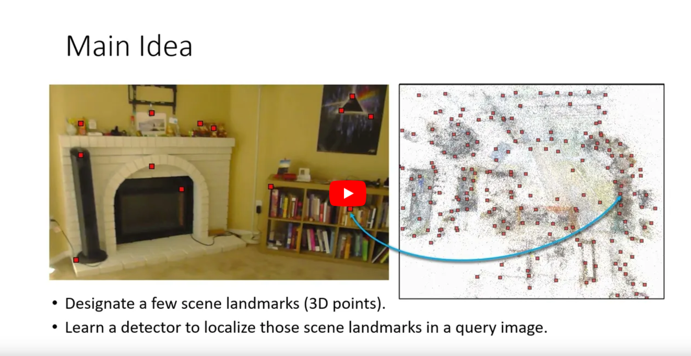

# Learning to Detect Scene Landmarks for Camera Localization

This repository contains the source code and data for our paper:

**Learning to Detect Scene Landmarks for Camera Localization**  
Tien Do, Ondrej Miksik, Joseph DeGol, Hyun Soo Park, and Sudipta N. Sinha  
IEEE/CVF Conference on Computer Vision and Pattern Recognition (CVPR), 2022  
[dataset](https://drive.google.com/drive/folders/1nTAiDbQzhT3WI6Cvj0MdRv2MTcB0t3hw?usp=sharing) | [pdf](paper/FINAL.pdf) 

# Bibtex
If you find our work to be useful in your research, please consider citing our paper:
```
@InProceedings{Do_2022_SceneLandmarkLoc,
    author     = {Do, Tien and Miksik, Ondrej and DeGol, Joseph and Park, Hyun Soo and Sinha, Sudipta N.},
    title      = {Learning to Detect Scene Landmarks for Camera Localization},
    booktitle  = {Proceedings of the IEEE/CVF Conference on Computer Vision and Pattern Recognition (CVPR)},
    month      = {June},
    year       = {2022}
}
```

# Abstract


We present a new method to recognize scene-specific _scene landmarks_ to localize a camera, which preserves 
privacy and achieves high accuracy. [Left] Scene landmark detections in a query image obtained from a 
heatmap-based CNN architecture. [Middle] A visualization of the predicted heatmap scores. [Right] The 3D scene 
landmarks (in red) and the estimated camera pose (in blue) are shown over the 3D point cloud (in gray). The 3D point 
cloud is shown only for the purpose of visualization.

# Video

[](https://www.youtube.com/watch?v=HM2yLCLz5nY "Everything Is AWESOME")

# Indoor-6 dataset

### Description
Our Indoor-6 dataset was created from multiple sessions captured in six indoor scenes over multiple days. The pseudo 
ground truth (pGT) 3D point clouds and camera poses for each scene are computed using [COLMAP](https://colmap.github.io/). The figure below 
shows the camera poses (in red) and point clouds (in gray) and for each scene, the number of video and images in the 
training and test split respectively. Compared to [7-scenes](https://www.microsoft.com/en-us/research/project/rgb-d-dataset-7-scenes/), the scenes in Indoor-6 are larger, have multiple rooms, 
contains illumination variations as the images span multiple days and different times of day.


Indoor-6 dataset SfM reconstructions. We split them into train/test images. The urls for download these scenes are 
below:
* [scene1](https://drive.google.com/file/d/1SJeaUJJsir4WqrV_4ZkYgVqhGwWeM0eZ/view?usp=sharing) (6289/799 images)
* [scene2] (3021/284 images) 
* [scene2a] ()
* [scene3](https://drive.google.com/file/d/1wyJhQbzLEs0_Fhtrdegi1GxBkZlKiamn/view?usp=sharing) (4181/315 images)
* [scene4] (1947/227 images)
* [scene4a] ()
* [scene5](https://drive.google.com/file/d/1mdlz-uc9D6eS7MJtjf_09Wof0PAoaqj4/view?usp=sharing) (4946/424 images)
* [scene6](https://drive.google.com/file/d/1cuHbm_Sdy3hbUJLdFrYftguUUY_35bYc/view?usp=sharing) (1761/323 images)

[comment]: <> (### Organization)


# Code (plan to release on November 2022)

[comment]: <> (### Installation)

[comment]: <> (### Training)

[comment]: <> (### Evaluation)


# Contributing

This project welcomes contributions and suggestions.  Most contributions require you to agree to a
Contributor License Agreement (CLA) declaring that you have the right to, and actually do, grant us
the rights to use your contribution. For details, visit https://cla.opensource.microsoft.com.

When you submit a pull request, a CLA bot will automatically determine whether you need to provide
a CLA and decorate the PR appropriately (e.g., status check, comment). Simply follow the instructions
provided by the bot. You will only need to do this once across all repos using our CLA.

This project has adopted the [Microsoft Open Source Code of Conduct](https://opensource.microsoft.com/codeofconduct/).
For more information see the [Code of Conduct FAQ](https://opensource.microsoft.com/codeofconduct/faq/) or
contact [opencode@microsoft.com](mailto:opencode@microsoft.com) with any additional questions or comments.

# Legal Notices

Microsoft and any contributors grant you a license to the Microsoft documentation and other content
in this repository under the [Creative Commons Attribution 4.0 International Public License](https://creativecommons.org/licenses/by/4.0/legalcode),
see the [LICENSE](LICENSE) file, and grant you a license to any code in the repository under the [MIT License](https://opensource.org/licenses/MIT), see the
[LICENSE-CODE](LICENSE-CODE) file.

Microsoft, Windows, Microsoft Azure and/or other Microsoft products and services referenced in the documentation
may be either trademarks or registered trademarks of Microsoft in the United States and/or other countries.
The licenses for this project do not grant you rights to use any Microsoft names, logos, or trademarks.
Microsoft's general trademark guidelines can be found at http://go.microsoft.com/fwlink/?LinkID=254653.

Privacy information can be found at https://privacy.microsoft.com/en-us/

Microsoft and any contributors reserve all other rights, whether under their respective copyrights, patents,
or trademarks, whether by implication, estoppel or otherwise.
