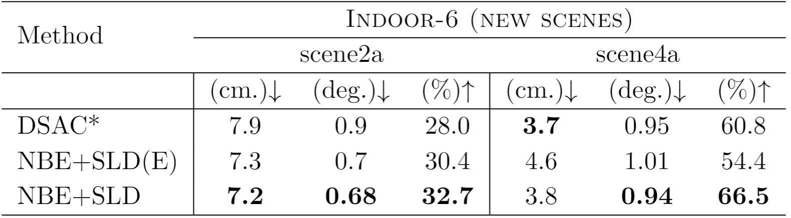
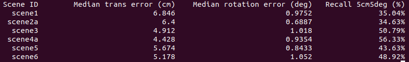
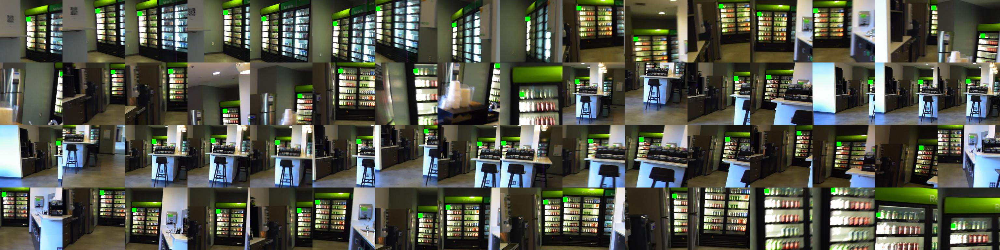

# Learning to Detect Scene Landmarks for Camera Localization

This repository contains the source code and data for our paper:

**Learning to Detect Scene Landmarks for Camera Localization**  
Tien Do, Ondrej Miksik, Joseph DeGol, Hyun Soo Park, and Sudipta N. Sinha  
IEEE/CVF Conference on Computer Vision and Pattern Recognition (CVPR), 2022  
[dataset](https://drive.google.com/drive/folders/1nTAiDbQzhT3WI6Cvj0MdRv2MTcB0t3hw?usp=sharing) | [pdf](paper/FINAL.pdf) 

# Bibtex
If you find our work to be useful in your research, please consider citing our paper:
```
@InProceedings{Do_2022_SceneLandmarkLoc,
    author     = {Do, Tien and Miksik, Ondrej and DeGol, Joseph and Park, Hyun Soo and Sinha, Sudipta N.},
    title      = {Learning to Detect Scene Landmarks for Camera Localization},
    booktitle  = {Proceedings of the IEEE/CVF Conference on Computer Vision and Pattern Recognition (CVPR)},
    month      = {June},
    year       = {2022}
}
```

# Abstract


We present a new method to recognize scene-specific _scene landmarks_ to localize a camera, which preserves 
privacy and achieves high accuracy. [Left] Scene landmark detections in a query image obtained from a 
heatmap-based CNN architecture. [Middle] A visualization of the predicted heatmap scores. [Right] The 3D scene 
landmarks (in red) and the estimated camera pose (in blue) are shown over the 3D point cloud (in gray). The 3D point 
cloud is shown only for the purpose of visualization.

# Video

[](https://www.youtube.com/watch?v=HM2yLCLz5nY)

# Indoor-6 dataset

### Description
Our Indoor-6 dataset was created from multiple sessions captured in six indoor scenes over multiple days. The pseudo 
ground truth (pGT) 3D point clouds and camera poses for each scene are computed using [COLMAP](https://colmap.github.io/). All training data uses only colmap reconstruction from training images. The figure below 
shows the camera poses (in red) and point clouds (in gray) and for each scene, the number of video and images in the 
training and test split respectively. Compared to [7-scenes](https://www.microsoft.com/en-us/research/project/rgb-d-dataset-7-scenes/), the scenes in Indoor-6 are larger, have multiple rooms, 
contains illumination variations as the images span multiple days and different times of day.


Indoor-6 dataset SfM reconstructions. We split them into train/val/test images. The urls for download these scenes are 
below:
* [scene1](https://drive.google.com/file/d/1SJeaUJJsir4WqrV_4ZkYgVqhGwWeM0eZ/view?usp=sharing) (6289/798/799 images)
* scene2 (3021/283/284 images) 
* [scene2a](https://drive.google.com/file/d/1_6ry9TTpruw6gOI5WJmiprI4l3gb-YN2/view?usp=sharing) (4890/256/257 images)
* [scene3](https://drive.google.com/file/d/1wyJhQbzLEs0_Fhtrdegi1GxBkZlKiamn/view?usp=sharing) (4181/313/315 images)
* scene4 (1942/272/272 images)
* [scene4a](https://drive.google.com/file/d/1ywLifH9-RAedjM-oCAR2CshHEinwawJz/view?usp=sharing) (2285/158/158 images)
* [scene5](https://drive.google.com/file/d/1mdlz-uc9D6eS7MJtjf_09Wof0PAoaqj4/view?usp=sharing) (4946/512/424 images)
* [scene6](https://drive.google.com/file/d/1cuHbm_Sdy3hbUJLdFrYftguUUY_35bYc/view?usp=sharing) (1761/322/323 images)
* [colmap]() (colmap reconstructions for all scenes.)

**Note**: The table below shows quantitative results on two new scenes (scene2a and scene4a) that were added to the dataset after the paper was published. Unfortunately, we are unable to release scene2 and scene4 from the original dataset due to privacy reasons. Therefore, we have created these scenes as a replacement and released them.
<p align="center">

<p/>


# Code

The code is inside [src](./src/), make sure that you downloaded the newest version of the dataset that is compatible with the code. The code can be used to train the model from scratch and evaluate the pretrained models. Please refer to the following subsections for training a model or evaluating pretrained models. 


## Installation
```
pip install -r requirements.txt
```


## Training

Download the indoor6 dataset using the links above and stored them under `dataset_directory/`, such as:

```
dataset_directory
            └── indoor6
                    ├── indoor6-colmap                            
                    └── scene1
                    └── scene2a
                    └── scene3
                    └── scene4a
                    └── scene5
                    └── scene6
```

**Note** We run colmap on two sets of images: (1) using all images (`indoor6-colmap/scenex`) and (2) using only training images (`indoor6-colmap/scenex-tr`), then align them.

There are two approaches to train the scene landmark detector for each scene. The first approach directly works on the full 2D input images. The second approach extract patches from the training images on-the-fly and then training a detector on these patches. The argument --action must be set to `train` or `train_patches` in order to use these two approaches respectively as follows:

* Train using full images to obtain the scene landmark detector for `scene1`:
```
python main.py --action train --dataset_folder /dataset_directory/indoor6/ --scene_id scene1 --output_folder train_log_directory/
```

* Train using image patches to obtain the scene landmark detector for `scene1`:

```
python main.py --action train_patches --dataset_folder /dataset_directory/indoor6/ --scene_id scene1 --output_folder train_log_directory/
```

*** Note that in the previous example code, all the training output is stored at `train_log_directory/scene1/`. At each epoch, the latest model is kept at `train_log_directory/scene1/model-latest.ckpt`, and evaluated on the validation set. The model with the lowest median angular error is stored in `train_log_directory/scene1/model-best_median.ckpt`  

## Evaluate pretrained models

1. Download the pretrained models for all scenes [here](https://drive.google.com/file/d/1iRRgIvJJJH3IfTeBB2iC9mF5o8uJK3qR/view?usp=share_link) and put them under `pretrained_models_directory/` as:

```
    pretrained_models_directory
                    ├── scene1.ckpt
                    └── scene2a.ckpt
                    └── scene3.ckpt
                    └── scene4a.ckpt
                    └── scene5.ckpt
                    └── scene6.ckpt
```

2. Evaluation all pretrained models

```
python main.py --action test --dataset_folder /dataset_directory/indoor6/ --scene_id all --output_folder test_log_directory/ --pretrained_model pretrained_models_directory/
```

You should see the evaluation table at the end:



3. Evaluate a specific scene, for example `scene1`:

```
python main.py --action test --dataset_folder /dataset_directory/indoor6/ --scene_id scene1 --output_folder test_log_directory/scene1/ --pretrained_model pretrained_models_directory/scene1.ckpt`
```

## Landmark Selection

To select the best L (e.g., 300) landmarks out of all 3D points triangulated from colmap on scene6, we run the following script:

```
python utils/landmark_selection.py --dataset_folder /dataset_directory/indoor6/ --scene_id scene6 --num_landmarks 300
```

This script create 2 new files landmarks-300v2.txt and visibility-300v2.txt that are stored under `dataset_directory/indoor6/scene6/landmarks/`. Note that this result is slightly different than the original version due to changes in thresholds and restructure.

To visualize the new selected landmark, we run the following script:
```
python utils/patches_per_landmark_visualization.py --dataset_folder /home/tien/Data/MSR/Data/indoor6 --output_folder visualization_folder --landmark_config landmarks/landmarks-300v2 --visibility_config landmarks/visibility-300v2 --scene_id scene6 --num_landmarks 300
```

The output visualization is stored under `visualization_folder` where each subfolder (000-299) contains multiple cropped of training images that observes that landmark, for example, in folder `visualization_folder/000` we can find the following image, the green square denotes the landmark 0th's 2D location.




# Contributing

This project welcomes contributions and suggestions.  Most contributions require you to agree to a
Contributor License Agreement (CLA) declaring that you have the right to, and actually do, grant us
the rights to use your contribution. For details, visit https://cla.opensource.microsoft.com.

When you submit a pull request, a CLA bot will automatically determine whether you need to provide
a CLA and decorate the PR appropriately (e.g., status check, comment). Simply follow the instructions
provided by the bot. You will only need to do this once across all repos using our CLA.

This project has adopted the [Microsoft Open Source Code of Conduct](https://opensource.microsoft.com/codeofconduct/).
For more information see the [Code of Conduct FAQ](https://opensource.microsoft.com/codeofconduct/faq/) or
contact [opencode@microsoft.com](mailto:opencode@microsoft.com) with any additional questions or comments.

# Legal Notices

Microsoft and any contributors grant you a license to the Microsoft documentation and other content
in this repository under the [Creative Commons Attribution 4.0 International Public License](https://creativecommons.org/licenses/by/4.0/legalcode),
see the [LICENSE](LICENSE) file, and grant you a license to any code in the repository under the [MIT License](https://opensource.org/licenses/MIT), see the
[LICENSE-CODE](LICENSE-CODE) file.

Microsoft, Windows, Microsoft Azure and/or other Microsoft products and services referenced in the documentation
may be either trademarks or registered trademarks of Microsoft in the United States and/or other countries.
The licenses for this project do not grant you rights to use any Microsoft names, logos, or trademarks.
Microsoft's general trademark guidelines can be found at http://go.microsoft.com/fwlink/?LinkID=254653.

Privacy information can be found at https://privacy.microsoft.com/en-us/

Microsoft and any contributors reserve all other rights, whether under their respective copyrights, patents,
or trademarks, whether by implication, estoppel or otherwise.
